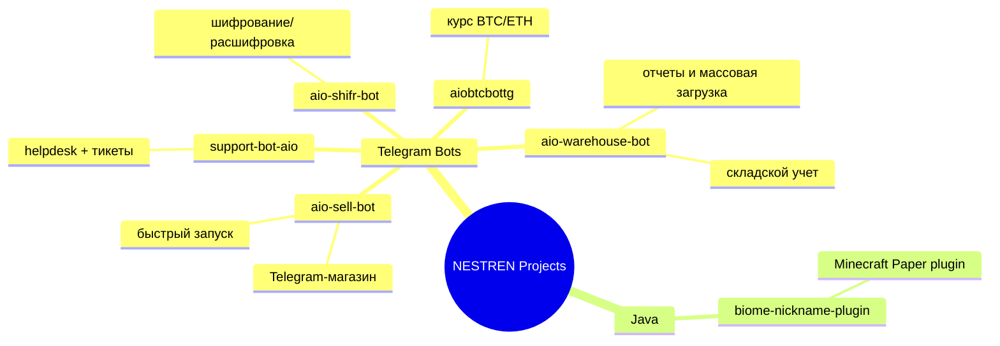

# 👋 Привет, я Юрий (@NESTREN)

💻 **Python-разработчик**, фокус: **Telegram-боты, автоматизация, чистая архитектура, быстрый запуск MVP**.

  
  

---

## 🧠 Профиль в 30 сек
- 🤖 Проектирую и разрабатываю Telegram-ботов на **aiogram**
- 🏗 Умею строить логику через **FSM**, сервисный слой и модули
- 🗄 Работаю с **SQLite**, постепенно усиливаю стек в сторону **PostgreSQL**
- 🚀 Делаю решения, которые можно быстро запустить и поддерживать
- 🔧 Люблю понятную структуру проекта, DX и аккуратный UX в Telegram

---

## 🛠 Технологический стек

### Основной

### Изучаю / усиливаю

---

## 🗺 Схема текущих репозиториев (по направлениям)

---

## 🚀 Проекты

### ⭐ Ключевые проекты
| Проект | Что делает | Технологии | Ссылка |
|---|---|---|---|
| **aio-warehouse-bot** | Склад-бот для бизнеса: остатки, склады, отчеты, массовая загрузка | Python, aiogram, SQLite | [GitHub](https://github.com/NESTREN/aio-warehouse-bot) |
| **aio-sell-bot** | Готовый Telegram-магазин с чистой архитектурой и удобным UX | Python, aiogram, SQLite | [GitHub](https://github.com/NESTREN/aio-sell-bot) |

### 📦 Другие проекты
| Проект | Кратко | Ссылка |
|---|---|---|
| **aiobtcbottg** | Бот с актуальным курсом BTC/ETH по `/price` | [GitHub](https://github.com/NESTREN/aiobtcbottg) |
| **support-bot-aio** | Helpdesk-бот: тикеты, админ-панель, изображения, SQLite | [GitHub](https://github.com/NESTREN/support-bot-aio) |
| **aio-shifr-bot** | Шифрование/расшифровка сообщений в формате `SHIFR1.<payload>` | [GitHub](https://github.com/NESTREN/aio-shifr-bot) |
| **biome-nickname-plugin** | Java-плагин для Minecraft Paper: цветной индикатор в чате и табе | [GitHub](https://github.com/NESTREN/biome-nickname-plugin) |

---

## 🧭 Roadmap
- [ ] Переводить новые проекты на PostgreSQL
- [ ] Контейнеризировать ботов через Docker
- [ ] Добавить фоновые задачи/очереди
- [ ] Настроить production-ready деплой на VPS
- [ ] Сделать шаблон собственного boilerplate для Telegram-ботов

---

## 📈 GitHub активность

  
  

---

## 🎯 Цель
Расти как backend/Python-инженер и создавать полезные Telegram-продукты: от идеи до стабильного продакшн-решения.

## 📫 Контакты
- Telegram: **[@nestren](https://t.me/nestren)**
