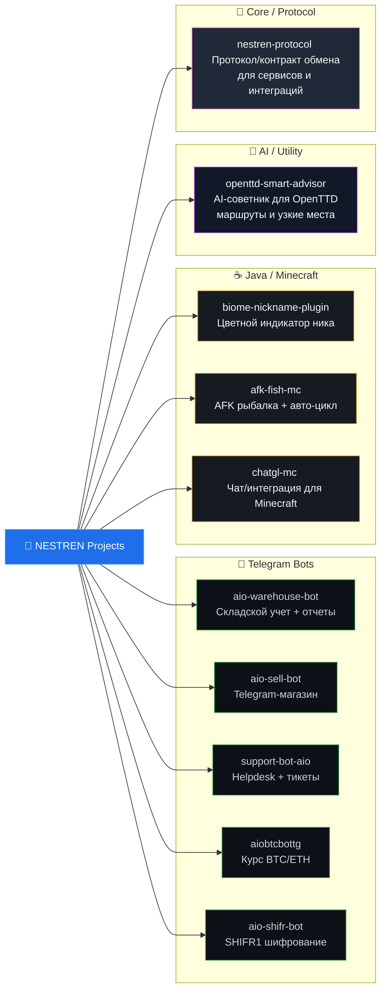

# 👋 Привет, я нест

💻 **Python-разработчик**, фокус: **Telegram-боты, автоматизация, чистая архитектура и быстрый запуск MVP**.

  
  
  

  
  
  
  

---

## 🧠 Профиль в 30 сек
- 🤖 Проектирую и разрабатываю Telegram-ботов на **aiogram**
- 🏗 Умею строить логику через **FSM**, сервисный слой и модульную архитектуру
- 🗄 Работаю с **SQLite**, постепенно усиливаю стек в сторону **PostgreSQL**
- 🚀 Делаю решения, которые можно быстро запустить и удобно поддерживать
- 🔧 Люблю чистый DX, понятную структуру проекта и аккуратный UX внутри Telegram

---

## 🛠 Технологический стек

### Основной

### Изучаю / усиливаю

---

## 🗺 Схема текущих репозиториев (по направлениям)

---

## 🆕 Последние репозитории

| Репозиторий | Статус | Что внутри | Ссылка |
|---|---|---|---|
| **openttd-smart-advisor** | New | AI-помощник для OpenTTD: подсказки по развитию города, планированию маршрутов и поиску узких мест транспортной сети. | [GitHub](https://github.com/NESTREN/openttd-smart-advisor) |
| **afk-fish-mc** | New | Minecraft-проект для AFK-рыбалки с упором на удобный сценарий использования и быструю настройку. | [GitHub](https://github.com/NESTREN/afk-fish-mc) |
| **chatgl-mc** | New | Новый Minecraft-репозиторий для чат-интеграции/геймплейных взаимодействий (Java/Paper-направление). | [GitHub](https://github.com/NESTREN/chatgl-mc) |
| **nestren-protocol** | New | Репозиторий протокола: единый контракт/формат взаимодействия между компонентами и интеграциями. | [GitHub](https://github.com/NESTREN/nestren-protocol) |

---

## 🚀 Проекты

### ⭐ Ключевые проекты
| Проект | Что делает | Технологии | Ссылка |
|---|---|---|---|
| **aio-warehouse-bot** | Склад-бот для бизнеса: остатки, склады, отчеты, массовая загрузка | Python, aiogram, SQLite | [GitHub](https://github.com/NESTREN/aio-warehouse-bot) |
| **aio-sell-bot** | Готовый Telegram-магазин с чистой архитектурой и удобным UX | Python, aiogram, SQLite | [GitHub](https://github.com/NESTREN/aio-sell-bot) |

### 📦 Другие Telegram-проекты
| Проект | Кратко | Ссылка |
|---|---|---|
| **aiobtcbottg** | Бот с актуальным курсом BTC/ETH по `/price` | [GitHub](https://github.com/NESTREN/aiobtcbottg) |
| **support-bot-aio** | Helpdesk-бот: тикеты, админ-панель, изображения, SQLite | [GitHub](https://github.com/NESTREN/support-bot-aio) |
| **aio-shifr-bot** | Шифрование/расшифровка сообщений в формате `SHIFR1.<payload>` | [GitHub](https://github.com/NESTREN/aio-shifr-bot) |

### ☕ Java-проекты
| Проект | Кратко | Ссылка |
|---|---|---|
| **biome-nickname-plugin** | Плагин для Minecraft Paper: цветной индикатор в чате и табе | [GitHub](https://github.com/NESTREN/biome-nickname-plugin) |
| **afk-fish-mc** | Minecraft-проект для AFK-рыбалки | [GitHub](https://github.com/NESTREN/afk-fish-mc) |
| **chatgl-mc** | Minecraft-репозиторий для чатовых механик/интеграции | [GitHub](https://github.com/NESTREN/chatgl-mc) |

### 🧠 AI / Utility-проекты
| Проект | Развернутое описание | Ссылка |
|---|---|---|
| **openttd-smart-advisor** | AI-инструмент для OpenTTD, который помогает принимать решения по развитию транспортной сети: оценивает текущее состояние города/логистики, предлагает следующие шаги, подсказывает приоритеты по маршрутам и помогает находить потенциальные узкие места. Подходит как быстрый «advice layer» при планировании долгой партии. | [GitHub](https://github.com/NESTREN/openttd-smart-advisor) |

### 🧩 Core / Protocol
| Проект | Описание | Ссылка |
|---|---|---|
| **nestren-protocol** | Базовый протокол/контракт для обмена данными между сервисами и проектами: задаёт общую структуру взаимодействия и облегчает интеграции между репозиториями. | [GitHub](https://github.com/NESTREN/nestren-protocol) |

---

## 📈 GitHub активность

  
  

  

  

---

## 🧭 Roadmap
- [ ] Переводить новые проекты на PostgreSQL
- [ ] Контейнеризировать ботов через Docker
- [ ] Добавить фоновые задачи/очереди
- [ ] Настроить production-ready деплой на VPS
- [ ] Сделать свой boilerplate для Telegram-ботов

---

## 🎯 Цель
Расти как backend/Python-инженер и создавать полезные Telegram-продукты: от идеи до стабильного продакшн-решения.

## 📫 Контакты
- Telegram: **[@nestren](https://t.me/nestren)**
